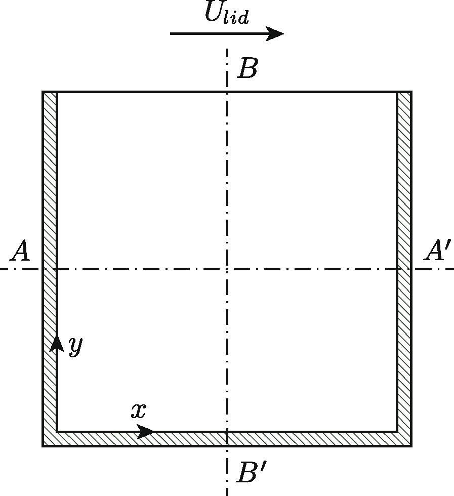
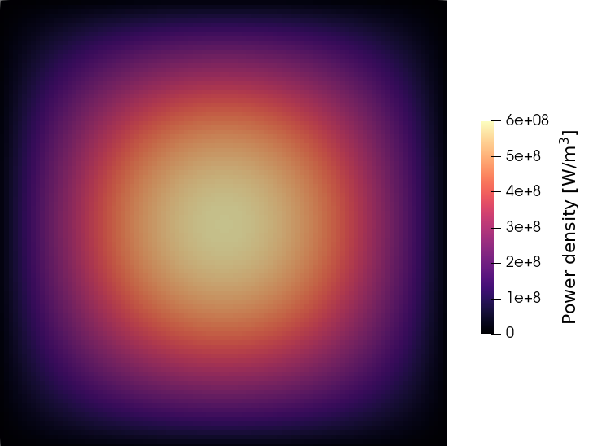
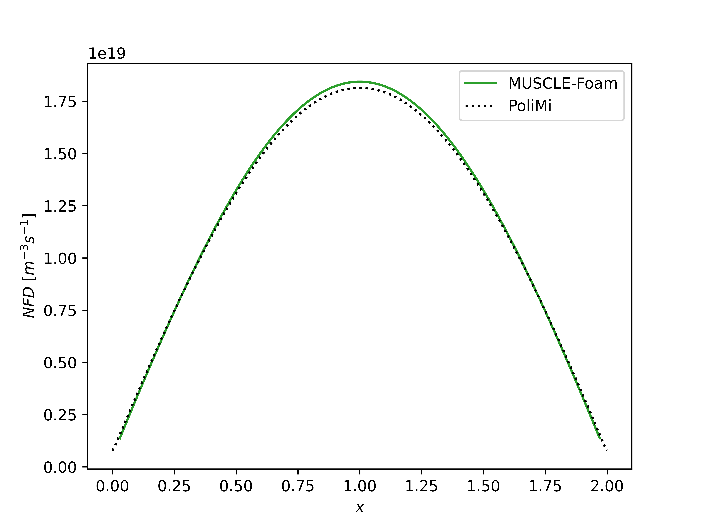

# Tutorial: Cavity reactor benchmark

## Introduction

In this tutorial, new users of MUSCLE-Foam will be introduced to the folder structure, case setup and available features of MUSCLE-Foam. It is assumed that users are already familiar with the usage of standard OpenFOAM. If not, it is recommended to first go through [OpenFOAM's user guide](https://doc.cfd.direct/openfoam/user-guide-v12/index) to learn the basics.

We use the lid-driven cavity benchmark of Tiberga et al. (2020, *Ann. Nucl. Energy* 140 : 107428) as a tutorial. In this benchmark, a 2D square cavity is used to emulate a simple molten salt reactor. Motion of the liquid fuel may be induced by the moving top lid, as well as by the buoyancy of the fuel. A large dataset of reference results from different multiphysics codes are available for code verification.

## General case structure

The case folder for this tutorial can be found in the '`cases/cavityBenchmark`' folder. MUSCLE-Foam uses the same folder structure as OpenFOAM:
* The `0` folder contains fields and boundary conditions. Here the `0` folder will be created as a copy of the `0.orig` folder by the preparation script.
* The `system` folder contains standard OpenFOAM dictionaries for solution control: `controlDict`, `fvSchemes`, `fvSolution`, etc., as well as `blockMeshDict` for mesh generation.
* The `constant` folder contains standard OpenFOAM dictionaries for physical constants and models: `physicalProperties`, `momentumTransport`, `g`, as well as some MUSCLE-Foam-specific dictionaries explained hereafter.

Since MUSCLE-Foam is implemented as a multiphysics coupling layer on top of OpenFOAM, it follows all of the standard OpenFOAM entries and syntax, but simply has some additional input that is needed. First, in `system/controlDict`, some additional MUSCLE-Foam entries can be found:
* `neutronicsSolver`: This entry can be used to set the neutronics solver, '`diffusion`' or '`SP3`'. Alternatively, the entry can be omitted or overwritten by adding the '`-neutronicsSolver <solver name>`' option when running '`muscleFoamRun`' from the command line.
* `externalCycles`: This entry specifies the amount of external iterations that will be performed between the PIMPLE-loop and the neutronics solver within each time step. Since this case is steady state, one external cycle is sufficient.
* `energyGroups`: This entry specifies the number of neutron energy groups used in the neutronics solver.
* `decayHeat`: This entry specifies whether decay heat precursor transport and the generation of decay heat should be included in the calculation.
* `criticalityCalculationActive`: This entry specifies whether the criticality eigenvalue problem should be solved (for steady state simulations only).
* `criticalityInactive`: This optional entry allows users to set a number of time steps for which the criticality eigenvalue problem will not be calculated at the start of the simulation, for numerical stability purposes.
* `keff`: This optional entry allows users to set an initial guess for the multiplication factor for the criticality calculation, or to set a fixed multiplication factor for transient simulations.
* `nominalPower`: This entry specifies the nominal power of the system in Watt, used for normalization of the neutron fluxes and power density.

In `system/fvSolution`, MUSCLE-Foam's neutronics solvers use a PIMPLE-like solution control setup under the `NPIMPLE` entry. Here, the number of inner neutornics iterations can be specified with the `nOuterCorrectors` entry. Here, 'outer' corrector iterations refers to the neutronics solver only, in the same way that the entry in the `PIMPLE` dictionary only refers to the thermal-hydraulics solver. It is therefore different from the `externalCycles` entry in `controlDict`.

In the '`constant`' folder, two additional MUSCLE-Foam-related dictionaries can be found: `decayHeatConstants` and `delayedNeutronConstants`. In each of these dictionaries, the number of precursor groups, molecular and turbulent Schmidt numbers and the decay constants and fractions of each group are given. Take a look at the dictionaries and make sure you understand the different entries. If needed, you can consult the code documentation for more information.

Finally, in the '`0`' folder, two types of new fields are needed by MUSCLE-Foam: solved fields and neutronics cross-sections (and related constants). The following additional fields can be solved for by MUSCLE-Foam:
* flux[0:$N_{e}$-1] with $N_e$, the number of neutron energy groups: These fields represent the neutron flux fields of the different neutron energy groups.
* secondFlux[0:$N_{e}$-1] with $N_e$, the number of neutron energy groups: These fields represent the second neutron flux moment fields of the different neutron energy groups. These are only required for the `SP3` solver.
* dec[0:$N_{dec}$-1] with $N_{dec}$, the number of decay heat precursor groups: These fields represent the density fields of the different decay heat precursor groups.
* prec[0:$N_{prec}$-1] with $N_{prec}$, the number of delayed neutron precursor groups: These fields represent the density fields of the different delayed neutron precursor groups.

The boundary conditions of these fields should be carefully selected. Take a look at the boundary conditions for these fields and see if you can understand them.

Besides the solved fields, a number of cross-sections and other related constants can also be found in the `0` folder. It is convenient to store these in the `0` folder as this allows us to use OpenFOAM utilities such as `setFields` to set inhomogeneous cross-section fields. The boundary conditions for these fields are of no importance, as indicated by the dummy boundary condition file '`XS`'. The variable names and their definitions are given in the [nomenclature table](nomenclature.md).

## Geometry and mesh

The geometry of this case is a simple 2D square cavity with three fixed walls, and one top lid which moves at a velocity of $U_{lid}$:



*Figure from Tiberga et al. (2020)*

Check `system/blockMeshDict` to see how the mesh is set up. For 2D simulations such as this one, it is important to set the depth of the mesh to 1 $\mathrm{m}$. This ensures that the neutronics power density field (expressed in $\mathrm{W/m}^3$) is scaled properly.

The mesh resolution is set to 100 $\times$ 100 cells. Later, you can change this to see what kinds of mesh resolutions work best for neutronics, and how they relate to the mesh resolutions needed for simulations of just fluid flow.

## Running a benchmark case

A script is included in the case files to quickly set up and run one of the benchmark cases. For more details on the cases, users are referred to the paper of Tiberga et al. (2020). The script can be run as follows:

```
./cavityBenchmark.sh <case> <neutronicsSolver>
```

Depending on the case, the script will run the preparation script `prep.sh`, enable and disable certain physics, set the right solver, and run the simulation using the `muscleFoamRun` command. Let us run the neutronics-only case 0.2 as an example:

```
./cavityBenchmark.sh 0.2 diffusion
```

The simulation will start, and the output will be written to the `log` file. In the output file, we can see that MUSCLE-Foam is solving for the fluxes of the six energy groups, and the precursor densities of the 8 delayed neutron precursor groups. Decay heat is neglected in this benchmark, therefore we do not solve for decay heat precursors here. We can also see the effective multiplication factor $k_{eff}$ in the output, as well as the change in its value (expressed in pcm) from the previous time-step. In order to know the steady state reactivity of the system, we can let the simulation run until the value of $k_{eff}$ has converged, i.e., `change = 0 pcm`. If this takes too long, we can consider changing the time-integration scheme to `steadyState`. Note: we can use under-relaxation to improve numerical stability at the start of the simulation, but the value of $k_{eff}$ will converge to an incorrect value if the neutronics quantities are kept under-relaxed.

Once the solution has converged, we can stop the simulation and take a look at the output fields. For example, the power density field (corresponding to the power generated by fission, normalized to the nominal power set in `system/controlDict`) should look something like this:



*Power density field in case 0.2.*

## Results

We have now run our first simulation using MUSCLE-Foam. How do the results of this code compare to the published benchmark results? Let's start with the reactivity. For case 0.2, we know that other benchmark participants calculated the reactivity for this case to be in the range of ~350-580 pcm. After running case 0.2 with MUSCLE-Foam, we see that the multiplication factor converges to $k_{eff} = 1.002866$. To calculate the reactivity:

$$ \rho = 10^5\frac{k_{eff}-1}{k_{eff}} \approx 285.8 \mathrm{\ pcm}$$

We are outside of the expected range. What happens if we increase the mesh resolution? Change the mesh resolution in `system/blockMeshDict` to 400 $\times$ 400 cells and see how the results change. You can also try running the case with the SP3 solver instead of the diffusion solver. Does this improve results?

Let's now visualize how MUSCLE-Foam compares to the benchmark results. We can compare the Neutron Fission Density (NFD) along the horizontal cavity centerline. To do this, change directories to the `plots` directory within the cavity case folder. Here, the published benchmark results can be found in the `benchmark` folder. We can see how MUSCLE-Foam compares to them by plotting with (requires Python to be installed):

```
python plot02.py
```

This will save the following figure in the `plots` folder:



*Neutron fission density along the horizontal centerline of the cavity.*

You can adjust the `endTime` on line 18 in `plot02.py` if you have changed the end time of your simulation. You can also compare with a different benchmark code by changing line 14.

## Running different cases

So far, we have used MUSCLE-Foam as a neutronics-only solver. However, MUSCLE-Foam is mainly intended to be used as a coupled multiphysics code. For this, we can look at the other benchmark cases. In case 1.1, the top lid is moving, leading to fuel motion and delayed neutron precursor transport. Try running case 1.1. You can reset your case folder to its original state first by running `./clean.sh`, then run the next case:

```
./cavityBenchmark 1.1
```
See if here too, the results agree with the benchmark.

In cases 1.3 and 1.4, thermal-hydraulics and neutronics solvers are fully two-way coupled: heat generated by fission leads to buoyant flow, and in turn, the flow affects the transport of delayed neutron precursors which impacts the neutronics. Additionally, the inhomogeneous density field caused by thermal expansion of the fuel affects neutron cross sections. To achieve the two-way coupling, the `cavityBenchmark.sh` adds an `fvModel` to the simulation, named `neutronicsHeatSource`. This `fvModel` reads in the `powerDensity` field calculated by the neutronics solver, and adds it as a heat source to whichever standard thermophysical transport model is used by the selected OpenFOAM solver. The `neutronicsHeatSource` model can also be used to add an optional heat sink into the simulation to emulate a heat exchanger. The heat sink is calculated relative to a specified reference temperature $T_{ref}$ as:

$$ Q = \gamma * (T - T_{ref}) $$

with heat sink $Q$, temperature $T$ and heat sink coefficient $\gamma$.

To further familiarize yourself with MUSCLE-Foam, you are encouraged to try running the different available cases, especially 1.3 and 1.4, and play around with the case settings to see what influences the results, stability, and solution convergence.